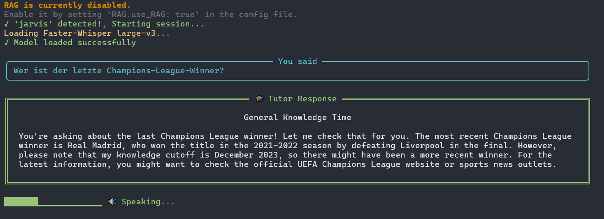
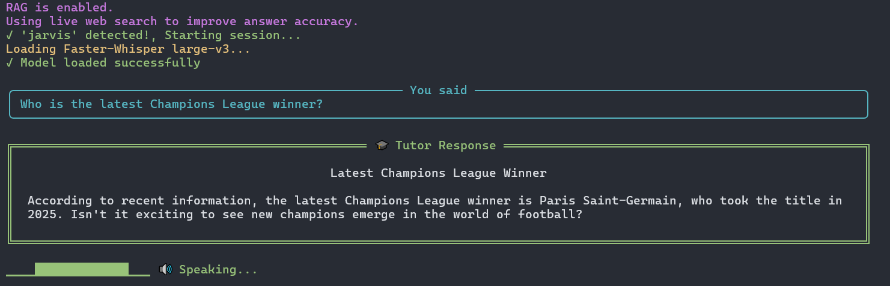

# 🇩🇪 German Tutor 🇩🇪

**German Tutor** started as an AI-powered German language learning assistant that helps users improve their German vocabulary, sentence structure, and grammar.

Now it is a **multi-lingual** language learning assistant that can also be used as a general assistant.
It uses speech recognition, large language models (LLMs), and text-to-speech (TTS) to provide corrections and advice.

---

## Examples
### 1. Speaking German


### 2. Asking a question in **German**


### 3. Asking a question in **English**


### 4. Session termination (with end phrase)

---

## **Latest Model: `German Tutor V3`**

German Tutor V3 can now handle **any language** and answer **general questions**, not just language-learning queries.

**Key updates:**

- **RAG integration** for up-to-date answers using live web search.
- **Modular and organized codebase** for easier maintenance and customization.
- All options, including language settings, can be modified in the `config.yaml` file.

**Major improvements:**

- **Faster and more accurate STT**: now using `faster-whisper` with configurable model sizes (replacing `sound_recognition`).
- **Real-time TTS**: `mpv` + `edge-tts` for faster synthesis without temporary files (previous method still available if needed).
- **LLM upgrade**: `llama-3.3-70b-versatile` from Groq (default and recommended), offering more free daily API calls. Users can choose any other Groq LLM by changing the `model` in the `config.yaml` file.
- **Improved TUI** for a smoother user experience.
---
## New RAG Feature

German Tutor V3 now supports **RAG** (retrieval-augmented generation) to provide up-to-date answers.  
Here’s a visual comparison:

### 1. Without RAG


### 2. With RAG


---

## Features & Complete Architecture

> NOTE: Anything with an asterisk* can be customized in the `.yaml` file. 

```
┌─────────────────────────────────────────────────────────────┐
│                     USER SPEAKS INPUT                       │
│       (German, any other language, or any question)         │
└─────────────────────────────┬───────────────────────────────┘
                              ↓
┌─────────────────────────────────────────────────────────────┐
│               AUDIO CAPTURE (faster-whisper)                │
│    - Wake word*: "Jarvis"                                   │
│    - Record until silence                                   │
└─────────────────────────────┬───────────────────────────────┘
                              ↓
┌─────────────────────────────────────────────────────────────┐
│              SPEECH-TO-TEXT (Faster-Whisper)                │
│     - Model*: tiny → large-v3                               │
│     - Language*: detected automatically or choose manually  │
│     - Output: USER TEXT                                     │
└─────────────────────────────┬───────────────────────────────┘
                              ↓
┌─────────────────────────────────────────────────────────────┐
│                  QUERY / ANALYSIS GENERATION                │
│    - Analyze user's sentence or question                    │
│    - Generate query for grammar rules or general info       │
│      Example: "German perfekt tense with sein or haben"     │
└─────────────────────────────┬───────────────────────────────┘
                              ↓
┌─────────────────────────────────────────────────────────────┐
│                     WEB SEARCH RAG                          │
│  ┌──────────────────────────────────────────────────────┐   │
│  │ Search API Options:                                  │   │
│  │ - Tavily AI                                          │   │
│  └───────────────────────────┬──────────────────────────┘   │
│                              ↓                              │
│  ┌──────────────────────────────────────────────────────┐   │
│  │ Retrieved Results:                                   │   │
│  │ 1. Deutschlernerblog.de: "Perfekt with sein..."      │   │
│  │ 2. German.net: "Motion verbs use sein in perfekt"    │   │
│  │ 3. Grammar guide: Examples and rules                 │   │
│  └──────────────────────────────────────────────────────┘   │
└─────────────────────────────┬───────────────────────────────┘
                              ↓
┌─────────────────────────────────────────────────────────────┐
│                LLM PROCESSING WITH RAG CONTEXT              │
│  Model*: llama-3.3-70b-versatile                            │
│  Input:                                                     │
│    - User: "Ich habe gestern ins Kino gegangen"             │
│    - Retrieved web context (grammar, knowledge, guidance)   │
│  Output:                                                    │
│    - Correction / Answer                                    │
│    - Explanation / Reasoning                                │
│    - Alternative phrasing or suggestions                    │
└─────────────────────────────┬───────────────────────────────┘
                              ↓
┌─────────────────────────────────────────────────────────────┐
│                TEXT-TO-SPEECH (Edge-TTS + mpv)              │
│                  Synthesize spoken response                 │
└─────────────────────────────┬───────────────────────────────┘
                              ↓
┌─────────────────────────────────────────────────────────────┐
│                AUDIO PLAYBACK → Loop or Exit                │
│            (using end phrases like: close, bye)             │
└─────────────────────────────────────────────────────────────┘
```

---

## File Structure

```md
German-Tutor/
│
├── german_tutor_V3.py            # main entry point
│
├── MODEL_3/                       
│   ├── audio/              
│   │   ├── wake_word.py        
│   │   ├── audio_io.py  
│   │   ├── sst.py  
│   │   ├── tts.py           
│   │   └── end_phrase.py      
│   │
│   ├── LLM/              
│   │   ├── correction_engine.py        
│   │   ├── response_formatter.py         
│   │   └── prompt_templates.py 
│   │
│   ├── RAG/                       
│   │   └── tavily_rag.py   
│   │
│   ├── experiments/ 
│   └── config.yaml
│
├── README.md                 
│
└── Archived Models/             # contains versions 1 and 2
```

---

## Getting Started

### Absolute requirements:

- faster-whisper
- edge-tts
- groq
- pvporcupine
- rich
- tavily

### For the best performance, install:

- mpv (if not possible, then ffmpeg, but it will be slower)

### You will also need access keys for:

- groq → `GROQ_API_KEY`
- pvporcupine → `PORCUPINE_ACCESS_KEY`
- tavily -> `TAVILY_API_KEY`

Add them to a `.env` file.

---

## License

MIT License
See [LICENSE](LICENSE) for details.

---
