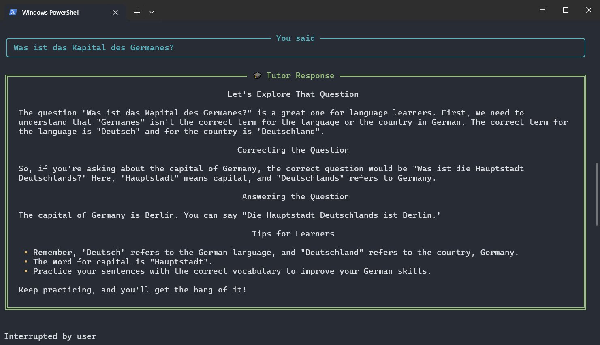
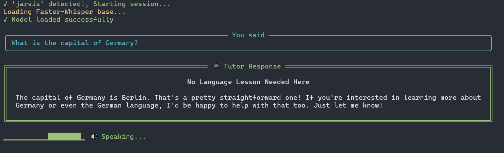
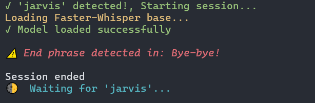

# 🇩🇪 German Tutor 🇩🇪

**German Tutor** started as an AI-powered German language learning assistant that helps users improve their German vocabulary, sentence structure, and grammar.

Now it is a **multi-lingual** language learning assistant that can also be used as a general assistant.
It uses speech recognition, large language models (LLMs), and text-to-speech (TTS) to provide corrections and advice.

---

## Examples
### 1. Speaking German


### 2. Asking a question in **German**


### 3. Asking a question in **English**


### 4. Session termination (with end phrase)


## **Latest Model: `German Tutor V3`**

The German Tutor can now work with any language and answer any question, including non-language-learning related questions.

The source code is now more professional, modular, and organized.

To change any option, including language, modify the `config.yaml` file.

- Uses `faster-whisper` instead of the `sound_recognition` library for faster and more accurate results, with more options for model size.
- Uses `mpv` with `edge-tts` for faster real-time TTS instead of creating and deleting temporary files (that option is still there, if users can't install `mpv`).
- Uses `llama-3.3-70b-versatile` model from `groq` for a higher number of **free** daily API calls.
- Improved `TUI`.

→ Currently working on RAG implementation.

---

## Features & Complete Architecture

> NOTE: Anything with an asterisk* can be customized in the `.yaml` file. 

```
┌─────────────────────────────────────────────────────────────┐
│                     USER SPEAKS INPUT                       │
│       (German, any other language, or any question)         │
└─────────────────────────────┬───────────────────────────────┘
                              ↓
┌─────────────────────────────────────────────────────────────┐
│               AUDIO CAPTURE (faster-whisper)                │
│    - Wake word*: "Jarvis"                                   │
│    - Record until silence                                   │
└─────────────────────────────┬───────────────────────────────┘
                              ↓
┌─────────────────────────────────────────────────────────────┐
│              SPEECH-TO-TEXT (Faster-Whisper)                │
│     - Model*: tiny → large-v3                               │
│     - Language*: detected automatically or choose manually  │
│     - Output: USER TEXT                                     │
└─────────────────────────────┬───────────────────────────────┘
                              ↓
┌─────────────────────────────────────────────────────────────┐
│                  QUERY / ANALYSIS GENERATION                │
│    - Analyze user's sentence or question                    │
│    - Generate query for grammar rules or general info       │
│      Example: "German perfekt tense with sein or haben"     │
└─────────────────────────────┬───────────────────────────────┘
                              ↓
┌─────────────────────────────────────────────────────────────┐
│                     WEB SEARCH RAG                          │
│                   [work in progress]                        │
│  ┌──────────────────────────────────────────────────────┐   │
│  │ Search API Options:                                  │   │
│  │ - Tavily AI (best for RAG)                           │   │
│  │ - SerpAPI (Google results)                           │   │
│  │ - Brave Search API                                   │   │
│  │ - DuckDuckGo (free, no API key)                      │   │
│  └───────────────────────────┬──────────────────────────┘   │
│                              ↓                              │
│  ┌──────────────────────────────────────────────────────┐   │
│  │ Retrieved Results:                                   │   │
│  │ 1. Deutschlernerblog.de: "Perfekt with sein..."      │   │
│  │ 2. German.net: "Motion verbs use sein in perfekt"    │   │
│  │ 3. Grammar guide: Examples and rules                 │   │
│  └──────────────────────────────────────────────────────┘   │
└─────────────────────────────┬───────────────────────────────┘
                              ↓
┌─────────────────────────────────────────────────────────────┐
│                LLM PROCESSING WITH RAG CONTEXT              │
│  Model*: llama-3.3-70b-versatile                            │
│  Input:                                                     │
│    - User: "Ich habe gestern ins Kino gegangen"             │
│    - Retrieved web context (grammar, knowledge, guidance)   │
│  Output:                                                    │
│    - Correction / Answer                                    │
│    - Explanation / Reasoning                                │
│    - Alternative phrasing or suggestions                    │
└─────────────────────────────┬───────────────────────────────┘
                              ↓
┌─────────────────────────────────────────────────────────────┐
│                TEXT-TO-SPEECH (Edge-TTS + mpv)              │
│                  Synthesize spoken response                 │
└─────────────────────────────┬───────────────────────────────┘
                              ↓
┌─────────────────────────────────────────────────────────────┐
│                AUDIO PLAYBACK → Loop or Exit                │
│            (using end phrases like: close, bye)             │
└─────────────────────────────────────────────────────────────┘
```

---

## File Structure

```md
German-Tutor/
│
├── german_tutor_V3.py            # main entry point
│
├── MODEL_3/                       
│   ├── audio/              
│   │   ├── wake_word.py        
│   │   ├── audio_io.py  
│   │   ├── sst.py  
│   │   ├── tts.py           
│   │   └── end_phrase.py      
│   │
│   ├── LLM/              
│   │   ├── correction_engine.py        
│   │   ├── response_formatter.py         
│   │   └── prompt_templates.py 
│   │
│   ├── RAG/              
│   │   ├── context_processor.py        
│   │   ├── query_generator.py           
│   │   └── search.py   
│   │
│   ├── experiments/ 
│   └── config.yaml
│
├── README.md                 
│
└── Archived Models/             # contains versions 1 and 2
```

---

## Getting Started

### Absolute requirements:

- faster-whisper
- edge-tts
- groq
- pvporcupine
- rich

### For the best performance, install:

- mpv (if not possible, then ffmpeg, but it will be slower)

### You will also need access keys for:

- groq → `GROQ_API_KEY`
- pvporcupine → `PORCUPINE_ACCESS_KEY`

Add them to a `.env` file.

---

## License

MIT License
See [LICENSE](LICENSE) for details.

---
