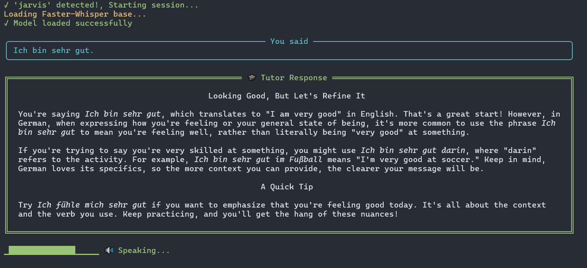
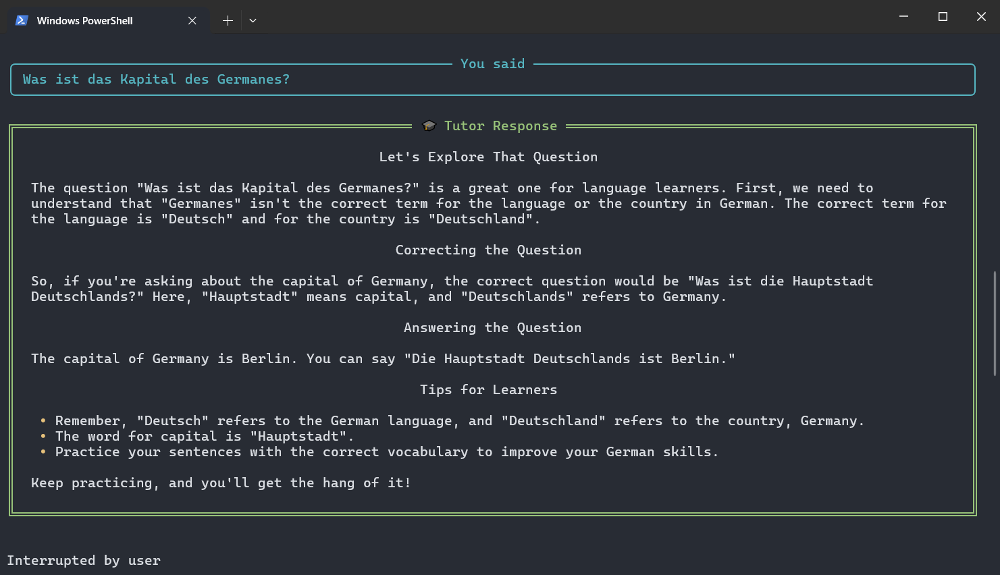
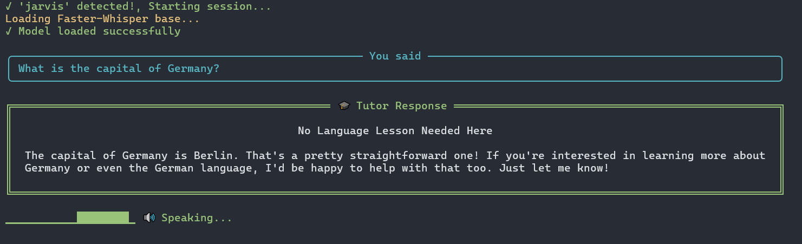
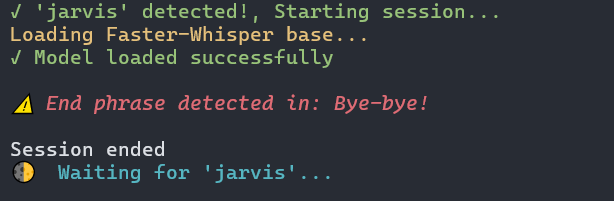
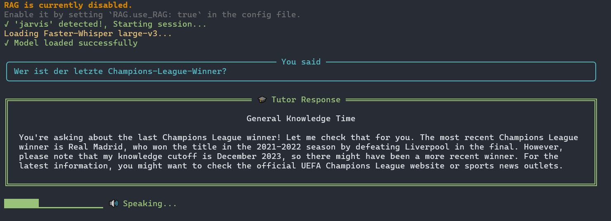
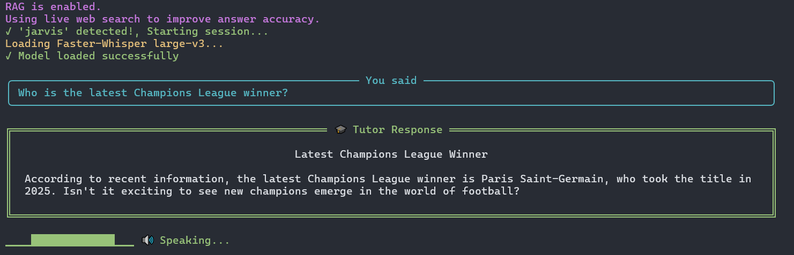

# 🇩🇪 German Tutor 🇩🇪

**German Tutor** started as an AI-powered German language learning assistant that helps users improve their German vocabulary, sentence structure, and grammar.

Now it is a **multi-lingual** language learning assistant that can also be used as a general assistant. It uses **speech recognition, large language models (LLMs), text-to-speech (TTS), and RAG (retrieval-augmented generation)** to provide corrections, explanations, and up-to-date answers.

---

## Examples
### 1. Speaking German


### 2. Asking a question in **German**


### 3. Asking a question in **English**


### 4. Session termination (with end phrase)

---

## **Latest Model: `German Tutor V3.1`**

German Tutor V3.1 is rebuilt around a **LangGraph ReAct pipeline** with full **session memory**.

**V3.1 updates:**

- **LangGraph ReAct pipeline**: the LLM now runs as a proper ReAct agent, it reasons, decides whether to call a tool, receives the result, and loops until it's ready to respond.
- **ReAct pipeline**: separated into a `react_agent` node (LLM reasoning) and a `retriever_agent` node (tool execution), connected via LangGraph's conditional edges.
- **Session memory**: conversation history is persisted across turns using LangGraph's `MemorySaver` checkpointer, the model remembers everything said earlier in the session.
- **TTS interruption**: TTS now runs in a background thread and can be interrupted mid-speech by pressing the enter key twice (text mode) or saying the wake word (audio mode).

---

## **Previous: `German Tutor V3.0`**

German Tutor V3 introduced multi-language support and general assistant capabilities.

**V3.0 updates:**

- **RAG integration** for up-to-date answers using live web search.
- **Modular and organized codebase** for easier maintenance and customization.
- All options, including language settings, can be modified in the `config.yaml` file.

**V3.0 major improvements:**

- **Faster and more accurate STT**: now using `faster-whisper` with configurable model sizes (replacing `sound_recognition`).
- **Real-time TTS**: `mpv` + `edge-tts` for faster synthesis without temporary files (previous method still available if needed).
- **LLM upgrade**: `openai/gpt-oss-120b` from Groq (default and recommended), offering more free daily API calls. Users can choose any other Groq LLM by changing the `model` in the `config.yaml` file.
- **Improved TUI** for a smoother user experience.
---
## New RAG Feature

German Tutor V3 now supports **two RAG modes** (retrieval-augmented generation):

- **Online RAG** (`tavily_rag.py`): live web search via Tavily AI, good for current events, up-to-date grammar references, and anything not in your local books.
- **Offline RAG** (`offline_rag.py`): searches a local vector database built from your own books/documents, works without internet and is faster for static reference material.

The ReAct agent decides which tool to use (or neither) based on the question.

Here's a visual comparison of RAG vs no RAG:

### 1. Without RAG


### 2. With RAG


---

## Features & Complete Architecture

> NOTE: Anything with an asterisk* can be customized in the `.yaml` file. 

```
┌─────────────────────────────────────────────────────────────┐
│                     USER SPEAKS INPUT                       │
│       (German, any other language, or any question)         │
└─────────────────────────────┬───────────────────────────────┘
                              ↓
┌─────────────────────────────────────────────────────────────┐
│               AUDIO CAPTURE (faster-whisper)                │
│    - Wake word*: "Jarvis"                                   │
│    - Record until silence                                   │
└─────────────────────────────┬───────────────────────────────┘
                              ↓
┌─────────────────────────────────────────────────────────────┐
│              SPEECH-TO-TEXT (Faster-Whisper)                │
│     - Model*: tiny → large-v3                               │
│     - Language*: detected automatically or choose manually  │
│     - Output: USER TEXT                                     │
└─────────────────────────────┬───────────────────────────────┘
                              ↓
┌─────────────────────────────────────────────────────────────────────┐
│              LANGGRAPH ReAct PIPELINE (with session memory)         │
│                                                                     │
│   ┌─────────────────────────────────────────────────────────────┐   │
│   │  react_agent node (LLM)                                     │   │
│   │   - Receives full conversation history (MemorySaver)        │   │
│   │   - Reasons about the input                                 │   │
│   │   - Decides: answer directly OR call a tool                 │   │
│   └───────────────────┬─────────────────┬───────────────────────┘   │
│            tool call? │                 │ no → final answer         │
│                       ↓                 ↓                           │
│   ┌───────────────────────────┐    ┌─────────────────────────────┐  │
│   │  retriever_agent node     │    │  END → response to user     │  │
│   │  Tool options:            │    └─────────────────────────────┘  │
│   │  - Tavily web search      │                                     │
│   │  - Offline book search    │                                     │
│   └──────────┬────────────────┘                                     │
│              │ tool result loops back to react_agent                │
│              └──────────────────────────────────────────────────────┘
└─────────────────────────────┬───────────────────────────────────────┘
                              ↓
┌─────────────────────────────────────────────────────────────┐
│                TEXT-TO-SPEECH (Edge-TTS + mpv)              │
│   - Runs in background thread (non-blocking)                │
│   - Interruptible mid-speech                                │
└─────────────────────────────┬───────────────────────────────┘
                              ↓
┌─────────────────────────────────────────────────────────────┐
│                AUDIO PLAYBACK → Loop or Exit                │
│            (using end phrases like: close, bye)             │
└─────────────────────────────────────────────────────────────┘
```

---

## File Structure

```md
German-Tutor/
│
├── german_tutor_V3.py            # main entry point
│
├── MODEL_3/                       
│   ├── graph.py                  # LangGraph pipeline (ReAct loop + memory)
│   ├── config.yaml
│   │
│   ├── audio/              
│   │   ├── wake_word.py        
│   │   ├── audio_io.py  
│   │   ├── stt.py  
│   │   ├── tts.py           
│   │   └── end_phrase.py      
│   │
│   ├── LLM/              
│   │   ├── react_agent.py        # ReAct agent node + AgentState
│   │   ├── response_formatter.py         
│   │   └── prompt_templates.py 
│   │
│   ├── RAG/                       
│   │   ├── tavily_rag.py         # live web search tool
│   │   └── offline_rag.py        # local book search tool
│   │
│   └── experiments/ 
│
├── README.md                 
│
└── Archived Models/             # contains versions 1 and 2
```

---

## Getting Started

### Absolute requirements:

- faster-whisper
- edge-tts
- groq
- langchain-groq
- langgraph
- pvporcupine
- rich
- tavily
- chromadb

### For the best performance, install:

- mpv (if not possible, then ffmpeg, but it will be slower)

### You will also need access keys for:

- groq → `GROQ_API_KEY`
- pvporcupine → `PORCUPINE_ACCESS_KEY`
- tavily -> `TAVILY_API_KEY`

Add them to a `.env` file.

---

## License

MIT License
See [LICENSE](LICENSE) for details.

---
